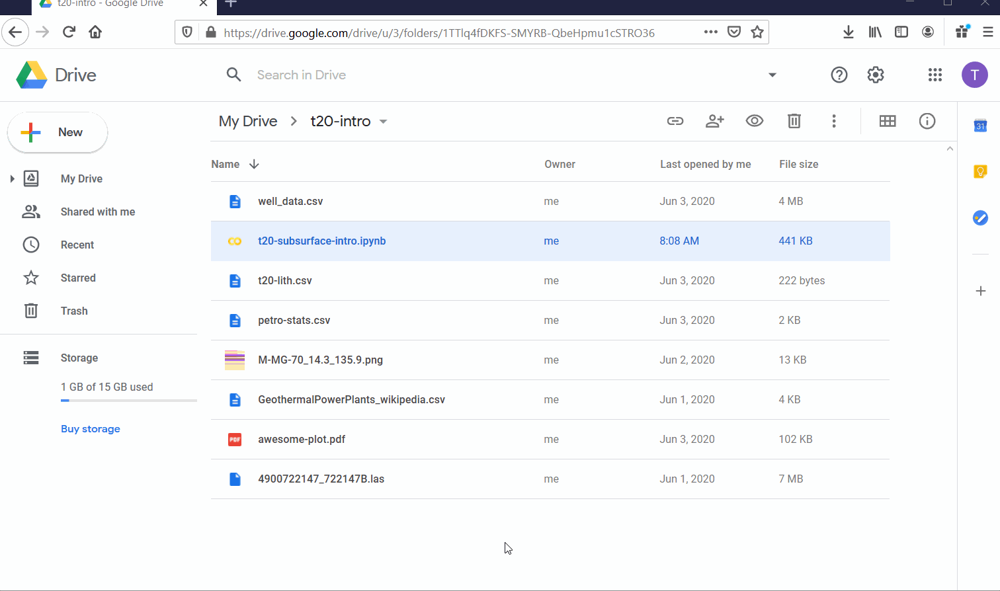

# CrudeAudacityMaps
"Geospatial mapping in python" webinar for the [Crude Audacity podcast](https://podcasts.apple.com/us/podcast/the-crude-audacity/id1480993402), September 23, 2020.

# Instructions
Instructions/Installation for use with [Colab](https://colab.research.google.com/notebooks/basic_features_overview.ipynb):

## Make a google account
If you don't have a google account, please create one, as we will be working from Google Drive today. 

If you have a gmail, you have an account already! (the free one will work fine, no need for Colab Pro).

## Download the .ipynb file
Download the "CrudeAudacityMaps" folder from this repository (green button in the upper right) and put it into your Google drive (you will have to unzip it). Doesn't really matter where you put it, but if you have a folder called 'Colab Notebooks', put it in there. 

Here is a GIF from a similar project made by Thomas Martin.

-----

## Activate Google Colab
Instead of installing python locally on your computer, Google Colab allows you to use python 'in the cloud'. Basically, you check out a Google computer and use it for free - pretty amazing. To install Google Colab in Google Drive, search Colaboratory in connected apps. This needs to be in the browser google drive, not the local folder on your hard drive.

Here is another GIF from a similar project made by Thomas Martin.

-----

## Open the ipynb file
In the web browser, navigate to the "CrudeAudacity_Geospatial.ipynb" file - right click on the .ipynb file to open with Google Colab.

## Enjoy!
